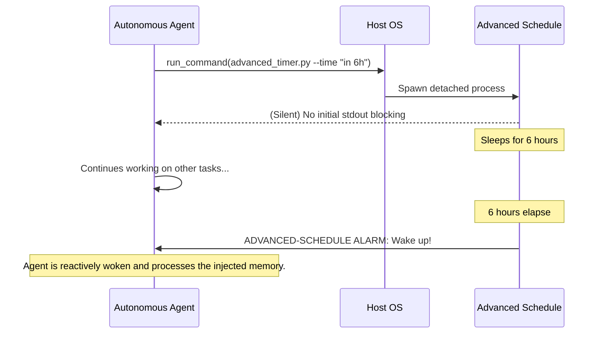

<div align="center">
  
# 🕒 Advanced Schedule (Agentic Background Timer)

[](https://python.org)
[](https://opensource.org/licenses/MIT)
[](#agent-integration)

A lightweight, natural language timer daemon built explicitly for Autonomous AI Agents and long-running LLM workflows.

[Installation](#installation) •
[Usage](#usage) •
[Architecture](#architecture) •
[Agent Integration](#agent-integration)

</div>

---

## 🛑 The Problem

Native agent scheduling tools (like the standard `schedule` or `sleep` API) typically enforce a hardcoded **15-minute execution limit**. This is an intentional guardrail to prevent an agent from blocking its context window and burning through compute resources while "waiting".

However, when building complex, autonomous, world-simulating systems, you often need an agent to wait for hours (or days) for a massive build to complete, a web server to spin up, or to send a recurring summary at an exact calendar time.

## 💡 The Solution

`advanced-schedule` provides a robust background Python daemon that:
1. Parses ambiguous, natural language time strings (e.g., *"in 6 hours"*, *"tomorrow at 9:00 AM"*).
2. Detaches and sleeps **completely silently** in the background, consuming ~0% CPU.
3. Wakes the agent up by injecting a structured stdout alarm back into the agent's context window.

---

## ⚙️ Architecture



---

## 🚀 Installation

You can run `advanced-schedule` as a standalone CLI tool or natively within an agent framework.

### Prerequisites
- Python 3.8+
- The `dateparser` library.

```bash
# Standard Pip
pip install dateparser

# Or use astral-sh/uv for ephemeral environments (Recommended)
uv run --with dateparser advanced_timer.py --time "in 1 hour" --message "Wake up"
```

---

## 💻 Usage (CLI)

The script requires exactly two arguments:
1. `--time`: The natural language time string.
2. `--message`: The exact payload you want injected back into standard output when the timer completes.

### Examples

**Specific Duration:**
```bash
python advanced_timer.py --time "in 6 hours" --message "Check the morning metrics"
```

**Specific Calendar Time:**
```bash
python advanced_timer.py --time "9:30 AM" --message "Generate the daily briefing."
```

**Relative Future Dates:**
```bash
python advanced_timer.py --time "tomorrow at noon" --message "Ping the staging server."
```

---

## 🤖 Agent Integration

This tool was built to be seamlessly integrated into **OpenClaw**, **Fractal Swarm**, and other autonomous agent ecosystems.

1. Drop the `SKILL.md` and `advanced_timer.py` files into your agent's `skills/` or `.agents/` configuration directory.
2. The agent will autonomously read the `SKILL.md` and learn the syntax.
3. When the agent realizes it needs to wait for a duration exceeding its native limits, it will automatically spawn the daemon via its `run_command` tool and continue working.

---

## 🤝 Contributing

Contributions are welcome! If you're building agentic swarms and find an edge-case in date parsing, feel free to open a PR.

## 📄 License

This project is licensed under the MIT License - see the [LICENSE](LICENSE) file for details.
