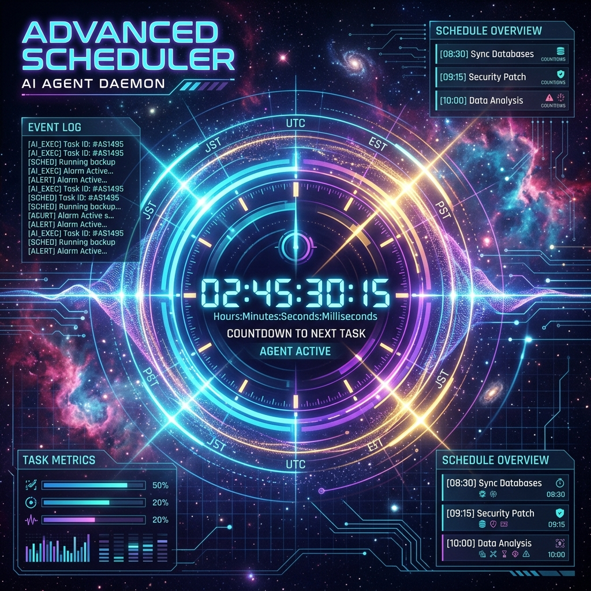
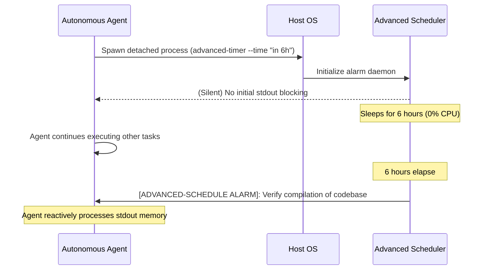

<div align="center">
  
</div>

<br>

<div align="center">

[](https://github.com/axtontc/Advanced-Scheduler/releases)
[](https://python.org)
[](LICENSE)
[](https://github.com/axtontc/Advanced-Scheduler/actions)

</div>

<br>

<h1 align="center">🕒 Advanced Scheduler — Natural Language Agent Alarm Daemon</h1>

<p align="center">
  <strong>A high-performance, natural language background sleep daemon designed for autonomous AI agents and long-running workflows. Bypasses standard agent execution limits with isolated background alarms.</strong>
</p>

<p align="center">
  <a href="#-quick-start">Quick Start</a> •
  <a href="#-the-problem">The Problem</a> •
  <a href="#-the-solution">The Solution</a> •
  <a href="#-architecture">Architecture</a> •
  <a href="#-agent-integration">Agent Integration</a> •
  <a href="#-ecosystem-cross-linking">Ecosystem</a>
</p>

---

## 🛑 The Problem

Native agent platforms (like Claude Desktop, Cursor, or custom SDKs) enforce short timeout boundaries. The standard sleep tools or timers block the main execution thread, which locks the context window and burns massive amounts of tokens while the agent is sitting idle "waiting".

Because of this, agents are typically restricted from schedules exceeding a few minutes, preventing them from waiting for hours for compilation builds, server initialization, or scheduled calendar tasks to trigger.

---

## 💡 The Solution

`advanced-schedule` runs an isolated, detached Python background process that:
1. **Parses Natural Language**: Parses complex time strings (e.g., *"in 6 hours"*, *"tomorrow at 9:00 AM"*, *"9:30 AM"*) using `dateparser` with future bias settings.
2. **Consumes 0% CPU**: Sleeps silently in the background of the host OS without taking up active thread locks.
3. **Injects Memory Alarms**: Wakes the agent up by outputting a structured memory payload into standard output when the timer expires.

---

## ⚡ Quick Start

### Prerequisites
- **Python 3.11+**
- **uv** (recommended for rapid dependency syncing)

### 1. Clone & Setup
```bash
git clone https://github.com/axtontc/Advanced-Scheduler.git
cd Advanced-Scheduler

# Sync virtual environment using uv
uv sync

# Or using pip
python -m venv .venv
.venv/Scripts/activate  # On Windows
source .venv/bin/activate  # On Linux/macOS
pip install .
```

### 2. Verify with the Test Suite
Ensure the time parsing and CLI validation runs pass:
```bash
uv run python -m pytest tests/ -v
```

---

## 💻 CLI Usage

The CLI requires two arguments:
* `--time`: Natural language time format string (e.g., `"in 2 hours"`, `"9:30 AM"`, `"tomorrow at noon"`).
* `--message`: The exact payload message output to standard output when the timer wakes.

### Examples

**Relative Duration:**
```bash
advanced-timer --time "in 6 hours" --message "Verify compilation of codebase"
```

**Specific Calendar Time:**
```bash
advanced-timer --time "9:30 AM" --message "Run daily sync checklist"
```

**Complex Relative Dates:**
```bash
advanced-timer --time "tomorrow at noon" --message "Ping staging endpoints"
```

---

## 🏗 Architecture



---

## 🤖 Agent Integration

To make this skill permanently available to your swarm:
1. Copy `SKILL.md` and `advanced_timer.py` into your agent's local skills directory (e.g., `.agents/skills/advanced-schedule/`).
2. When the agent reads `SKILL.md`, it learns the syntax rules.
3. If a task requires waiting longer than the standard run window, the agent will invoke the background daemon and pause execution safely.

---

## 🏗️ Core Subsystems

| Subsystem | Folder / File | Responsibility |
|---|---|---|
| **Daemon Entrypoint** | `advanced_timer.py` | CLI parsing, natural language extraction, delta sleep, and stdout notification injection |
| **Workflow CI** | `.github/workflows/ci.yml` | Automatic ruff style checking and multi-python version test executing |
| **Validation Tests** | `tests/test_advanced_timer.py` | Pytest suite validating mock datetime returns and argparse parameters |

---

## 📖 API & Core Functions Reference

### `advanced_timer.py`
These functions drive the natural language daemon loop:

| Function / Routine | Parameters | Description |
|---|---|---|
| `parse_time(time_str)` | `str` | Parses natural language time strings using `dateparser` biased toward future timestamps. Returns `datetime` or `None`. |
| `main()` | None | Resolves CLI options, verifies target times, sleeps for the delta duration, and outputs the alarm payload. |

---

## 📊 Comparison Matrix

| Scheduler Mode | standard `time.sleep` | Host OS `cron` | **Advanced Scheduler** |
|---|:---:|:---:|:---:|
| **Natural Language Inputs** | ❌ | ❌ | **✅ Yes (`dateparser`)** |
| **Detached Background Execution** | ❌ (Blocks thread) | ⚠️ OS Dependent | **✅ Yes (Detached process)** |
| **Injected Stdout Memory** | ❌ | ❌ | **✅ Yes (Context injection)** |
| **0% CPU Idle Footprint** | ✅ | ✅ | **✅ Yes** |
| **Offline Vector Memory Safe** | ❌ | ❌ | **✅ Yes (No context locks)** |

---

## 🧰 Tech Stack

* **Core Language**: Python 3.11+
* **Dependencies**: `dateparser`
* **Style Enforcement**: Ruff
* **Quality Verification**: mypy, pytest

---

## 🗺️ Roadmap

- [x] Natural language relative time parsing
- [x] Detached OS background daemon execution
- [x] Context-based stdout memory alarms injection
- [x] Multi-python version CI testing
- [ ] **Webhook Alerts** — Post HTTP notifications to external endpoints (Slack/Discord) when alarm finishes
- [ ] **State Persistence** — Store pending alarms in a lightweight local DB to survive system reboots
- [ ] **Interactive Management CLI** — List, pause, adjust, or cancel active running timer processes

---

## 🔗 Ecosystem Cross-Linking

Advanced Scheduler is part of the Antigravity agentic tool suite:

| Project | Description |
|---|---|
| [AUI](https://github.com/axtontc/AUI) | Zero-latency cross-process UI automation for Windows and Web |
| [MemMCP](https://github.com/axtontc/MemMCP) | Deterministic memory server with SQLite WAL and FAISS RRF |
| [The-Skillbrary](https://github.com/axtontc/The-Skillbrary) | Low-latency registry and FastMCP execution server for agent swarms |
| [Multiverse-Planner](https://github.com/axtontc/Multiverse-Planner) | Brute-forces optimal plans via timeline expansion and pruning |
| [Fractal-Swarm-v2](https://github.com/axtontc/Fractal-Swarm-v2) | Mathematically optimal state-machine agent swarm orchestration |
| [AntiMem](https://github.com/axtontc/AntiMem) | Memory daemon and compactor for Antigravity swarms |
| [OmniMem](https://github.com/axtontc/OmniMem) | PostgreSQL hybrid memory system for large enterprise swarms |

---

## 📜 License

This project is licensed under the Apache License, Version 2.0. See the [LICENSE](LICENSE) file for details. Copyright (c) 2026 Axton Carroll.

---

<div align="center">
  <br>
  <strong>⭐ If the Advanced Scheduler helps manage your agent execution loops, consider giving it a star!</strong>
  <br>
  <br>
  <a href="https://github.com/axtontc/Advanced-Scheduler">
    
  </a>
  <br>
  <br>
  <sub>Built by <a href="https://github.com/axtontc">Axton Carroll</a> — "Nothing is impossible, we merely don't know how to do it yet."</sub>
</div>
